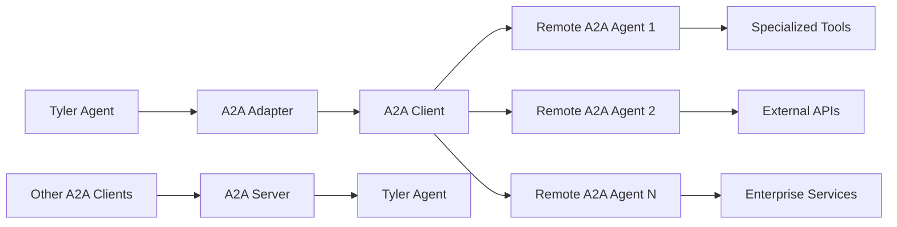

## What is A2A?

The Agent-to-Agent (A2A) Protocol is an open standard that enables AI agents from different platforms and frameworks to communicate and collaborate effectively. Slide's Tyler package includes comprehensive A2A support, allowing your agents to:

- Delegate tasks to remote A2A-compatible agents
- Expose Tyler agents as A2A endpoints for other systems
- Participate in multi-agent ecosystems across platforms
- Enable seamless interoperability between different agent frameworks

## A2A Architecture in Slide



## Quick Start

### Delegating to Remote A2A Agents

```python
import asyncio
from tyler import Agent, Thread, Message
from tyler.a2a import A2AAdapter

async def main():
    # Create A2A adapter
    adapter = A2AAdapter()
    
    # Connect to remote A2A agents
    await adapter.connect("research_agent", "https://research-service.example.com")
    await adapter.connect("analysis_agent", "https://analysis-service.example.com")
    
    # Create Tyler agent with delegation capabilities
    agent = Agent(
        name="Project Coordinator",
        model_name="gpt-4o",
        purpose="To coordinate complex projects using specialized remote agents",
        tools=adapter.get_tools_for_agent()  # Gets delegation tools
    )
    
    # Create a complex request that will be delegated
    thread = Thread()
    message = Message(
        role="user",
        content="Research quantum computing trends and analyze business opportunities"
    )
    thread.add_message(message)
    
    # Agent will automatically delegate to appropriate remote agents
    result = await agent.go(thread)

if __name__ == "__main__":
    asyncio.run(main())
```

### Exposing Tyler Agents via A2A

```python
import asyncio
from tyler import Agent
from tyler.a2a import A2AServer
from lye import WEB_TOOLS, FILES_TOOLS

async def main():
    # Create a Tyler agent with specific capabilities
    tyler_agent = Agent(
        name="Research Assistant",
        model_name="gpt-4o-mini",
        purpose="Advanced research specialist with web search and document processing",
        tools=[*WEB_TOOLS, *FILES_TOOLS]
    )
    
    # Create A2A server to expose the agent
    server = A2AServer(
        tyler_agent=tyler_agent,
        agent_card={
            "name": "Tyler Research Assistant",
            "description": "AI research specialist with web and document capabilities",
            "capabilities": ["web_research", "document_processing", "data_analysis"],
            "version": "1.0.0"
        }
    )
    
    # Start the A2A server
    await server.start_server(host="0.0.0.0", port=8000)
    # Agent is now accessible at http://localhost:8000

if __name__ == "__main__":
    asyncio.run(main())
```

## A2A Protocol Features

### 1. Agent Discovery

A2A uses **Agent Cards** to describe agent capabilities:

```python
agent_card = {
    "name": "Tyler Research Assistant",
    "version": "1.0.0", 
    "description": "Specialized research agent with web search capabilities",
    "capabilities": [
        "web_research",
        "fact_checking", 
        "data_analysis",
        "document_processing"
    ],
    "contact": {
        "name": "Your Organization",
        "email": "contact@yourorg.com"
    }
}
```

### 2. Task Management

A2A provides full task lifecycle management:

```python
# Create and track tasks
task_id = await adapter.create_task("research_agent", "Analyze market trends")

# Get task status
status = await adapter.get_task_status("research_agent", task_id)
print(f"Task status: {status['status']}")

# Stream real-time responses
async for message in adapter.stream_task_messages("research_agent", task_id):
    print(f"Agent response: {message['content']}")
```

### 3. Secure Communication

A2A supports standard web security practices:

```python
# Connect with authentication
await adapter.connect(
    "secure_agent",
    "https://secure-service.example.com",
    headers={"Authorization": "Bearer your-token"}
)
```

## Multi-Agent Coordination

### Creating Specialized Agent Networks

```python
import asyncio
from tyler import Agent
from tyler.a2a import A2AAdapter, A2AServer
from lye import WEB_TOOLS, FILES_TOOLS

async def create_agent_network():
    """Create a network of specialized A2A agents."""
    
    # Create specialized agents
    research_agent = Agent(
        name="Research Specialist",
        tools=[*WEB_TOOLS],
        purpose="Web research and information gathering expert"
    )
    
    analysis_agent = Agent(
        name="Analysis Specialist", 
        tools=[*FILES_TOOLS],
        purpose="Data analysis and strategic insights expert"
    )
    
    # Expose agents as A2A servers
    research_server = A2AServer(research_agent)
    analysis_server = A2AServer(analysis_agent)
    
    # Start servers (in production, these would be separate services)
    await research_server.start_server(port=8001)
    await analysis_server.start_server(port=8002)
    
    # Create coordinator that uses both agents
    adapter = A2AAdapter()
    await adapter.connect("research", "http://localhost:8001")
    await adapter.connect("analysis", "http://localhost:8002")
    
    coordinator = Agent(
        name="Project Coordinator",
        purpose="Orchestrate complex projects using specialized agents",
        tools=adapter.get_tools_for_agent()
    )
    
    return coordinator
```

### Task Delegation Patterns

The A2A adapter automatically creates delegation tools for each connected agent:

```python
# Delegation tools are automatically named and configured
delegation_tools = adapter.get_tools_for_agent()

# Each tool allows delegating specific tasks
for tool in delegation_tools:
    print(f"Tool: {tool['definition']['function']['name']}")
    print(f"Description: {tool['definition']['function']['description']}")
    print(f"Parameters: {tool['definition']['function']['parameters']}")
```

## Advanced A2A Usage

### Connection Management

```python
# List active connections
connections = adapter.list_connected_agents()
for conn in connections:
    print(f"Agent: {conn['agent_name']} at {conn['base_url']}")
    print(f"Capabilities: {', '.join(conn['capabilities'])}")

# Get detailed agent status
status = await adapter.get_agent_status("research_agent")
print(f"Active tasks: {status['active_tasks']}")
```

### Error Handling and Resilience

```python
try:
    # Attempt delegation
    result = await coordinator_agent.go(thread)
except Exception as e:
    if "connection failed" in str(e):
        # Handle connection issues
        await adapter.disconnect("failed_agent")
        # Implement fallback or retry logic
    else:
        raise
```

### Streaming Responses

```python
# Enable streaming for real-time responses
thread = Thread()
thread.add_message(Message(
    role="user",
    content="Delegate to research_agent with streaming: Analyze AI market trends"
))

async for update in agent.go_stream(thread):
    if update.type.name == "CONTENT_CHUNK":
        print(update.data, end="", flush=True)
    elif update.type.name == "TOOL_MESSAGE":
        print(f"\n[Delegating to: {update.data.name}]")
```

## A2A vs MCP Comparison

| Feature | A2A Protocol | MCP Protocol |
|---------|-------------|-------------|
| **Purpose** | Agent-to-agent communication | Model-to-tool communication |
| **Scope** | Multi-agent coordination | Tool integration |
| **Communication** | Task delegation & responses | Tool calls & results |
| **Architecture** | Agent ↔ Agent | Model ↔ Tools |
| **Use Cases** | Distributed agent systems | Tool ecosystem integration |

## Production Deployment

### Server Configuration

```python
# Production A2A server setup
server = A2AServer(
    tyler_agent=production_agent,
    agent_card={
        "name": "Production Research Agent",
        "version": "2.0.0",
        "description": "Enterprise research capabilities",
        "capabilities": ["web_research", "document_analysis", "market_intelligence"],
        "contact": {"email": "api-support@yourcompany.com"}
    }
)

# Start with production settings
await server.start_server(
    host="0.0.0.0",
    port=8000,
    # Additional uvicorn settings for production
)
```

### Client Best Practices

```python
# Connection pooling and retry logic
class ProductionA2AAdapter(A2AAdapter):
    def __init__(self):
        super().__init__()
        self.connection_pool = {}
        self.retry_config = {"max_retries": 3, "backoff_factor": 2}
    
    async def connect_with_retry(self, name: str, base_url: str):
        for attempt in range(self.retry_config["max_retries"]):
            try:
                return await self.connect(name, base_url)
            except Exception as e:
                if attempt == self.retry_config["max_retries"] - 1:
                    raise
                await asyncio.sleep(self.retry_config["backoff_factor"] ** attempt)
```

## Installation and Setup

### Install A2A Dependencies

```bash
# Install the A2A SDK
pip install a2a-sdk

# For server functionality, also install:
pip install uvicorn fastapi
```

### Environment Setup

```python
# Optional: Configure A2A settings
import os

# Set A2A agent base URL for discovery
os.environ["A2A_BASE_URL"] = "https://your-agent-service.com"

# Configure authentication if needed
os.environ["A2A_AUTH_TOKEN"] = "your-auth-token"
```

## Security Considerations

<Warning>
  **Production Security**: Always use HTTPS endpoints, implement proper authentication, and validate agent cards in production environments.
</Warning>

### Authentication Methods

```python
# Token-based authentication
await adapter.connect(
    "secure_agent",
    "https://secure-agent.example.com",
    headers={"Authorization": "Bearer your-secure-token"}
)

# Custom headers for API keys
await adapter.connect(
    "api_agent", 
    "https://api-agent.example.com",
    headers={
        "X-API-Key": "your-api-key",
        "X-Client-Version": "1.0.0"
    }
)
```

### Agent Card Validation

```python
# Validate agent capabilities before delegation
async def validate_agent(adapter: A2AAdapter, agent_name: str, required_capabilities: List[str]):
    agent_info = await adapter.get_agent_status(agent_name)
    if not agent_info:
        raise ValueError(f"Agent {agent_name} not available")
    
    agent_caps = agent_info.get("capabilities", [])
    missing_caps = set(required_capabilities) - set(agent_caps)
    
    if missing_caps:
        raise ValueError(f"Agent missing capabilities: {missing_caps}")
    
    return True
```

## Troubleshooting

<AccordionGroup>
  <Accordion title="Connection Issues">
    Common connection problems and solutions:
    ```python
    # Check agent availability
    try:
        await adapter.connect("test_agent", "http://agent-service.com")
    except Exception as e:
        if "connection refused" in str(e).lower():
            print("Agent service is not running or unreachable")
        elif "timeout" in str(e).lower():
            print("Connection timeout - check network or increase timeout")
        else:
            print(f"Unexpected error: {e}")
    ```
  </Accordion>

  <Accordion title="Task Failures">
    Handling task execution issues:
    ```python
    # Monitor task status
    task_id = await adapter.create_task("agent", "complex task")
    
    while True:
        status = await adapter.get_task_status("agent", task_id)
        if status["status"] == "error":
            print(f"Task failed: {status.get('error_message')}")
            break
        elif status["status"] == "completed":
            print("Task completed successfully")
            break
        
        await asyncio.sleep(1)  # Poll interval
    ```
  </Accordion>

  <Accordion title="Agent Card Issues">
    Debugging agent discovery problems:
    ```python
    # Inspect agent card
    info = adapter.get_connection_info("problem_agent")
    if info:
        print(f"Agent: {info['agent_name']}")
        print(f"Capabilities: {info['capabilities']}")
        print(f"Version: {info['agent_version']}")
    else:
        print("Agent not connected or agent card unavailable")
    ```
  </Accordion>
</AccordionGroup>

## Examples and Use Cases

### Enterprise Integration

```python
# Connect Tyler to enterprise A2A agents
enterprise_adapter = A2AAdapter()

# Connect to various enterprise services
await enterprise_adapter.connect("crm_agent", "https://crm-ai.company.com")
await enterprise_adapter.connect("analytics_agent", "https://analytics-ai.company.com")
await enterprise_adapter.connect("support_agent", "https://support-ai.company.com")

# Create enterprise coordinator
enterprise_agent = Agent(
    name="Enterprise Assistant",
    purpose="Coordinate across enterprise AI systems",
    tools=enterprise_adapter.get_tools_for_agent()
)
```

### Research Workflows

```python
# Multi-step research coordination
async def research_workflow(topic: str):
    coordinator = await create_research_coordinator()
    
    thread = Thread()
    thread.add_message(Message(
        role="user",
        content=f"""
        Conduct comprehensive research on: {topic}
        
        Please:
        1. Delegate initial research to the research specialist
        2. Have the analysis specialist process the findings
        3. Synthesize results into actionable insights
        """
    ))
    
    return await coordinator.go(thread)
```

## Best Practices

<Card title="Design Principles" icon="lightbulb">
  - **Specialized Agents**: Create agents with focused, well-defined capabilities
  - **Clear Interfaces**: Use descriptive agent cards and task descriptions
  - **Error Handling**: Implement robust connection and task failure handling
  - **Monitoring**: Track agent health and task completion rates
  - **Security**: Always use secure connections and proper authentication
</Card>

## Next Steps

<CardGroup cols={2}>
  <Card
    title="A2A Examples"
    icon="code"
    href="/packages/tyler/examples#a2a"
  >
    Explore complete A2A integration examples
  </Card>
  <Card
    title="Multi-Agent Patterns"
    icon="network-wired"
    href="/guides/agent-delegation"
  >
    Learn advanced delegation patterns
  </Card>
  <Card
    title="A2A Specification"
    icon="book"
    href="https://a2a-protocol.org"
  >
    Read the official A2A protocol specification
  </Card>
  <Card
    title="Agent Architecture"
    icon="sitemap"
    href="/concepts/architecture"
  >
    Understand Tyler's agent architecture
  </Card>
</CardGroup>