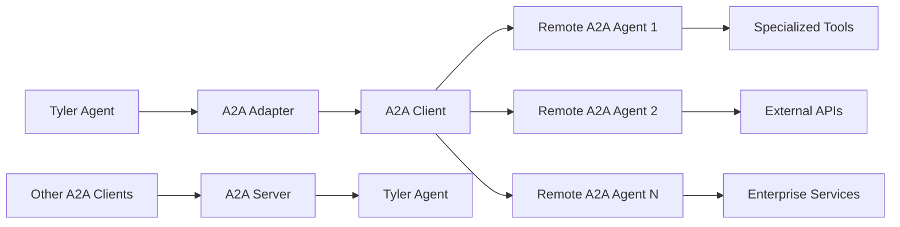

## What is A2A?

The Agent-to-Agent (A2A) Protocol is an open standard that enables AI agents from different platforms and frameworks to communicate and collaborate effectively. Slide's Tyler package includes comprehensive A2A v0.3.0 support, allowing your agents to:

- Delegate tasks to remote A2A-compatible agents
- Expose Tyler agents as A2A endpoints for other systems
- Exchange files, structured data, and text between agents
- Produce and consume Artifacts as task deliverables
- Group related tasks with context IDs
- Receive real-time updates via push notifications
- Enable seamless interoperability between different agent frameworks

<CardGroup cols={3}>
  <Card
    title="A2A Server"
    icon="server"
    href="https://github.com/adamwdraper/slide/blob/main/packages/tyler/examples/401_a2a_basic_server.py"
  >
    Expose a Tyler agent via A2A
  </Card>
  <Card
    title="A2A Client"
    icon="plug"
    href="https://github.com/adamwdraper/slide/blob/main/packages/tyler/examples/402_a2a_basic_client.py"
  >
    Connect to remote A2A agents
  </Card>
  <Card
    title="Multi-Agent"
    icon="network-wired"
    href="https://github.com/adamwdraper/slide/blob/main/packages/tyler/examples/403_a2a_multi_agent.py"
  >
    Coordinate multiple A2A agents
  </Card>
</CardGroup>

## A2A Architecture in Slide



## Quick start

### Delegating to Remote A2A Agents

```python
import asyncio
from tyler import Agent, Thread, Message
from tyler.a2a import A2AAdapter

async def main():
    # Create A2A adapter
    adapter = A2AAdapter()
    
    # Connect to remote A2A agents
    await adapter.connect("research_agent", "https://research-service.example.com")
    await adapter.connect("analysis_agent", "https://analysis-service.example.com")
    
    # Create Tyler agent with delegation capabilities
    agent = Agent(
        name="Project Coordinator",
        model_name="gpt-4.1",
        purpose="To coordinate complex projects using specialized remote agents",
        tools=adapter.get_tools_for_agent()  # Gets delegation tools
    )
    
    # Create a complex request that will be delegated
    thread = Thread()
    message = Message(
        role="user",
        content="Research quantum computing trends and analyze business opportunities"
    )
    thread.add_message(message)
    
    # Agent will automatically delegate to appropriate remote agents
    result = await agent.run(thread)

if __name__ == "__main__":
    asyncio.run(main())
```

### Exposing Tyler Agents via A2A

```python
import asyncio
from tyler import Agent
from tyler.a2a import A2AServer
from lye import WEB_TOOLS, FILES_TOOLS

async def main():
    # Create a Tyler agent with specific capabilities
    tyler_agent = Agent(
        name="Research Assistant",
        model_name="gpt-4.1",
        purpose="Advanced research specialist with web search and document processing",
        tools=[*WEB_TOOLS, *FILES_TOOLS]
    )
    
    # Create A2A server to expose the agent with authentication
    server = A2AServer(
        tyler_agent=tyler_agent,
        agent_card={
            "name": "Tyler Research Assistant",
            "description": "AI research specialist with web and document capabilities",
            "capabilities": ["web_research", "document_processing", "data_analysis"],
            "version": "1.0.0"
        },
        authentication={
            "schemes": ["bearer"],
            "required": True
        }
    )
    
    # Start the A2A server
    await server.start_server(host="0.0.0.0", port=8000)
    # Agent is now accessible at http://localhost:8000

if __name__ == "__main__":
    asyncio.run(main())
```

## A2A Protocol v0.3.0 Features

Tyler fully supports the A2A Protocol v0.3.0 specification, including:

### 1. All Part Types

A2A messages can contain multiple types of content:

```python
from tyler.a2a import TextPart, FilePart, DataPart

# Text content
text = TextPart(text="Analyze this document")

# File content (inline with bytes)
with open("document.pdf", "rb") as f:
    file_data = f.read()
file_part = FilePart(
    name="document.pdf", 
    media_type="application/pdf", 
    file_with_bytes=file_data
)

# File content (by URI reference)
remote_file = FilePart(
    name="report.xlsx", 
    media_type="application/vnd.openxmlformats-officedocument.spreadsheetml.sheet",
    file_with_uri="https://cdn.example.com/files/report.xlsx"
)

# Structured data
data_part = DataPart(data={
    "analysis_type": "financial",
    "parameters": {"period": "Q4", "metrics": ["revenue", "profit"]}
})
```

### 2. Artifacts

Artifacts are the formal deliverables of a task, providing structured outputs:

```python
from tyler.a2a import Artifact, TextPart, DataPart

# Create an artifact with task results
artifact = Artifact.create(
    name="Market Analysis Report",
    parts=[
        TextPart(text="Executive Summary: Market growth projected at 15%..."),
        DataPart(data={"growth_rate": 0.15, "confidence": 0.92}),
    ],
    metadata={"analysis_version": "2.0"}
)

# Access artifact properties
print(f"Artifact ID: {artifact.artifact_id}")
print(f"Created at: {artifact.created_at}")
```

### 3. Context ID for Task Grouping

Group related tasks together using context IDs:

```python
from tyler.a2a import A2AClient

client = A2AClient()
await client.connect("agent", "https://agent.example.com")

# Create multiple related tasks in the same context
context_id = "project-alpha-research"

task1_id = await client.create_task(
    "agent",
    "Research market trends",
    context_id=context_id
)

task2_id = await client.create_task(
    "agent", 
    "Analyze competitor landscape",
    context_id=context_id
)

# Get all tasks in a context
related_tasks = client.get_tasks_by_context(context_id)
```

### 4. Push Notifications

Receive real-time updates for long-running tasks via webhooks:

```python
from tyler.a2a import A2AClient, PushNotificationConfig

client = A2AClient()
await client.connect("agent", "https://agent.example.com")

# Configure push notifications
push_config = PushNotificationConfig(
    webhook_url="https://your-service.com/webhooks/a2a",
    events=["task.created", "task.updated", "task.completed", "task.artifact"],
    headers={"Authorization": "Bearer your-webhook-token"},
    secret="your-hmac-secret"  # For signature verification
)

# Create task with push notifications
task_id = await client.create_task(
    "agent",
    "Generate comprehensive market report",
    push_notification_config=push_config
)

# Your webhook will receive events like:
# {
#   "event_type": "task.completed",
#   "task_id": "...",
#   "timestamp": "...",
#   "data": {"status": "completed", "artifacts": [...]}
# }
```

### 5. Authentication Declaration

Declare authentication requirements in your Agent Card:

```python
from tyler.a2a import A2AServer

server = A2AServer(
    tyler_agent=my_agent,
    authentication={
        "schemes": ["bearer", "api_key"],
        "required": True
    }
)
```

## A2A Protocol Features

### Agent Discovery

A2A uses **Agent Cards** to describe agent capabilities:

```python
agent_card = {
    "name": "Tyler Research Assistant",
    "version": "1.0.0", 
    "description": "Specialized research agent with web search capabilities",
    "protocol_version": "0.3.0",
    "capabilities": [
        "web_research",
        "fact_checking", 
        "data_analysis",
        "document_processing",
        "artifacts"
    ],
    "push_notifications": {
        "supported": True,
        "events": ["task.created", "task.updated", "task.completed", "task.artifact"]
    },
    "authentication": {
        "schemes": ["bearer"],
        "required": False
    },
    "contact": {
        "name": "Your Organization",
        "email": "contact@yourorg.com"
    }
}
```

### Task Management

A2A provides full task lifecycle management:

```python
# Create and track tasks
task_id = await adapter.client.create_task("research_agent", "Analyze market trends")

# Get task status
status = await adapter.client.get_task_status("research_agent", task_id)
print(f"Task status: {status['status']}")
print(f"Has artifacts: {status['has_artifacts']}")

# Get task artifacts
artifacts = await adapter.client.get_task_artifacts("research_agent", task_id)
for artifact in artifacts:
    print(f"Artifact: {artifact.name}")
    for part in artifact.parts:
        if isinstance(part, TextPart):
            print(f"  Text: {part.text[:100]}...")

# Stream real-time responses
async for message in adapter.client.stream_task_messages("research_agent", task_id):
    print(f"Agent response: {message['content']}")
```

### Secure Communication

A2A supports standard web security practices:

```python
# Connect with authentication
await adapter.connect(
    "secure_agent",
    "https://secure-service.example.com",
    headers={"Authorization": "Bearer your-token"}
)
```

## Multi-Agent Coordination

### Creating Specialized Agent Networks

```python
import asyncio
from tyler import Agent
from tyler.a2a import A2AAdapter, A2AServer
from lye import WEB_TOOLS, FILES_TOOLS

async def create_agent_network():
    """Create a network of specialized A2A agents."""
    
    # Create specialized agents
    research_agent = Agent(
        name="Research Specialist",
        tools=[*WEB_TOOLS],
        purpose="Web research and information gathering expert"
    )
    
    analysis_agent = Agent(
        name="Analysis Specialist", 
        tools=[*FILES_TOOLS],
        purpose="Data analysis and strategic insights expert"
    )
    
    # Expose agents as A2A servers
    research_server = A2AServer(research_agent)
    analysis_server = A2AServer(analysis_agent)
    
    # Start servers (in production, these would be separate services)
    await research_server.start_server(port=8001)
    await analysis_server.start_server(port=8002)
    
    # Create coordinator that uses both agents
    adapter = A2AAdapter()
    await adapter.connect("research", "http://localhost:8001")
    await adapter.connect("analysis", "http://localhost:8002")
    
    coordinator = Agent(
        name="Project Coordinator",
        purpose="Orchestrate complex projects using specialized agents",
        tools=adapter.get_tools_for_agent()
    )
    
    return coordinator
```

### Task Delegation with Files and Data

```python
from tyler.a2a import A2AAdapter, FilePart, DataPart

adapter = A2AAdapter()
await adapter.connect("analysis_agent", "https://analysis.example.com")

# Create task with file attachment
task_id = await adapter.create_task_with_files(
    "analysis_agent",
    "Analyze the attached financial data",
    files=["./data/q4_report.xlsx", "./data/projections.csv"],
    context_id="financial-analysis-2024"
)

# Create task with structured data
task_id = await adapter.create_task_with_data(
    "analysis_agent",
    "Run analysis with these parameters",
    data={
        "analysis_type": "trend",
        "time_range": {"start": "2024-01", "end": "2024-12"},
        "metrics": ["revenue", "growth", "churn"]
    }
)
```

## A2A vs MCP Comparison

| Feature | A2A Protocol | MCP Protocol |
|---------|-------------|-------------|
| **Purpose** | Agent-to-agent communication | Model-to-tool communication |
| **Scope** | Multi-agent coordination | Tool integration |
| **Communication** | Task delegation & responses | Tool calls & results |
| **Architecture** | Agent ↔ Agent | Model ↔ Tools |
| **Use Cases** | Distributed agent systems | Tool ecosystem integration |

## Production Deployment

### Server Configuration

```python
# Production A2A server setup
server = A2AServer(
    tyler_agent=production_agent,
    agent_card={
        "name": "Production Research Agent",
        "version": "2.0.0",
        "description": "Enterprise research capabilities",
        "capabilities": ["web_research", "document_analysis", "market_intelligence", "artifacts"],
        "contact": {"email": "api-support@yourcompany.com"}
    },
    authentication={
        "schemes": ["bearer"],
        "required": True
    }
)

# Start with production settings
await server.start_server(
    host="0.0.0.0",
    port=8000,
)
```

## Installation and Setup

### Install A2A Dependencies

```bash
# Install Tyler (includes A2A support)
uv add slide-tyler

# A2A SDK is included as a dependency
```

### Environment Setup

```python
# Optional: Configure A2A settings
import os

# Set A2A agent base URL for discovery
os.environ["A2A_BASE_URL"] = "https://your-agent-service.com"

# Configure authentication if needed
os.environ["A2A_AUTH_TOKEN"] = "your-auth-token"
```

## Security Considerations

<Warning>
  **Production Security**: Always use HTTPS endpoints, implement proper authentication, and validate agent cards in production environments.
</Warning>

### Authentication Methods

```python
# Token-based authentication
await adapter.connect(
    "secure_agent",
    "https://secure-agent.example.com",
    headers={"Authorization": "Bearer your-secure-token"}
)

# Custom headers for API keys
await adapter.connect(
    "api_agent", 
    "https://api-agent.example.com",
    headers={
        "X-API-Key": "your-api-key",
        "X-Client-Version": "1.0.0"
    }
)
```

### Webhook Security

```python
from tyler.a2a import PushNotificationConfig

# Configure secure webhooks with HMAC signing
push_config = PushNotificationConfig(
    webhook_url="https://your-service.com/webhooks/a2a",
    secret="your-hmac-secret",  # Webhook payloads will be signed
    events=["task.completed", "task.artifact"]
)

# Verify webhook signature in your handler
import hmac
import hashlib

def verify_webhook(payload: str, signature: str, secret: str) -> bool:
    expected = hmac.new(
        secret.encode(),
        payload.encode(),
        hashlib.sha256
    ).hexdigest()
    return hmac.compare_digest(f"sha256={expected}", signature)
```

## Best practices

<Card title="Design Principles" icon="lightbulb">
  - **Specialized Agents**: Create agents with focused, well-defined capabilities
  - **Clear Interfaces**: Use descriptive agent cards and task descriptions
  - **Use Artifacts**: Structure task outputs as formal Artifacts for better interoperability
  - **Context Grouping**: Use context IDs to group related tasks for better tracking
  - **Push Notifications**: Use webhooks for long-running tasks instead of polling
  - **Error Handling**: Implement robust connection and task failure handling
  - **Monitoring**: Track agent health and task completion rates
  - **Security**: Always use secure connections and proper authentication
</Card>

## Next steps

<CardGroup cols={2}>
  <Card
    title="A2A Integration Guide"
    icon="code"
    href="/guides/a2a-integration"
  >
    Step-by-step A2A integration tutorial
  </Card>
  <Card
    title="Multi-Agent Patterns"
    icon="network-wired"
    href="/guides/agent-delegation"
  >
    Learn advanced delegation patterns
  </Card>
  <Card
    title="A2A Specification"
    icon="book"
    href="https://a2a-protocol.org"
  >
    Read the official A2A protocol specification
  </Card>
  <Card
    title="Agent Architecture"
    icon="sitemap"
    href="/concepts/architecture"
  >
    Understand Tyler's agent architecture
  </Card>
</CardGroup>
