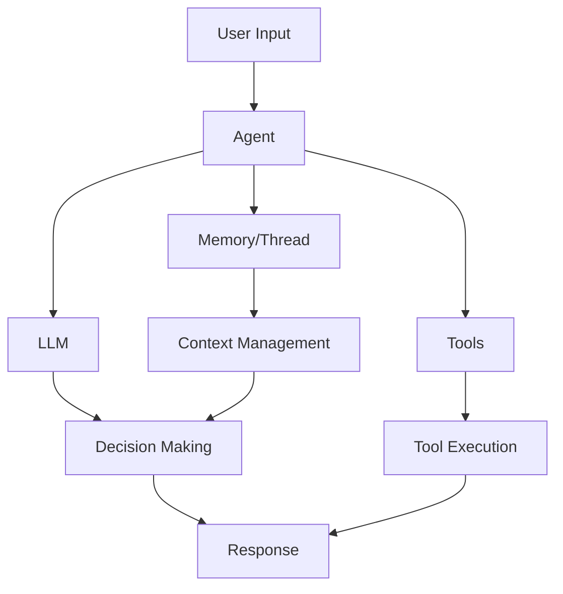

## What are Agents?

Agents in Slide are autonomous AI entities that can perceive their environment, make decisions, and take actions to achieve specific goals. They form the core of the Tyler package and are designed to be:

- **Autonomous**: Can operate independently with minimal human intervention
- **Tool-enabled**: Can use various tools from the Lye package
- **Stateful**: Can maintain conversation history through Narrator
- **Extensible**: Support custom tools and MCP integrations

## Agent Architecture



## Creating an Agent

### Basic Agent

```python
from tyler import Agent

# Minimal agent configuration
agent = Agent(name="assistant")

# With specific model
agent = Agent(
    name="gpt4-assistant",
    model="gpt-4",
    temperature=0.7
)
```

### Agent with Tools

```python
from tyler import Agent
from lye import web, files, image

agent = Agent(
    name="research-assistant",
    tools=[
        web.search,
        web.fetch,
        files.read,
        files.write,
        image.analyze
    ],
    system_prompt="You are a helpful research assistant."
)
```

## Agent Capabilities

### 1. Tool Usage

Agents can intelligently select and use tools based on the task:

```python
# Agent automatically chooses the right tool
result = await agent.run(
    "Search for recent AI developments and save a summary"
)
# Agent will: 1) Use web.search, 2) Use web.fetch for details, 3) Use files.write
```

### 2. Multi-step Reasoning

Agents can break down complex tasks:

```python
result = await agent.run("""
    1. Find the top 3 Python web frameworks
    2. Compare their features
    3. Create a comparison chart
    4. Save the analysis
""")
```

### 3. Context Awareness

With Narrator integration, agents maintain conversation context:

```python
from narrator import Thread

thread = Thread(thread_id="research-session")
agent = Agent(name="assistant", thread=thread)

# First query
await agent.run("What is FastAPI?")

# Follow-up uses context
await agent.run("How does it compare to Flask?")  # Knows we're talking about FastAPI
```

## Advanced Features

### Streaming Responses

For long-running tasks or real-time interaction:

```python
async for chunk in agent.stream("Write a detailed analysis of..."):
    print(chunk, end="", flush=True)
```

### Custom System Prompts

Fine-tune agent behavior:

```python
agent = Agent(
    name="code-reviewer",
    system_prompt="""You are an expert code reviewer. 
    Focus on: 
    - Security vulnerabilities
    - Performance optimizations
    - Best practices
    Always explain your reasoning."""
)
```

### Tool Configuration

Control how agents use tools:

```python
agent = Agent(
    name="safe-agent",
    tools=[files.read],  # Read-only access
    tool_choice="auto",  # or "none", "required", or specific tool name
    parallel_tool_calls=True  # Enable parallel execution
)
```

## Agent Patterns

### 1. Supervisor Pattern

```python
supervisor = Agent(
    name="supervisor",
    tools=[create_sub_agent, delegate_task],
    system_prompt="You coordinate work between specialized agents"
)

researcher = Agent(name="researcher", tools=[web.search, web.fetch])
writer = Agent(name="writer", tools=[files.write])
```

### 2. Tool Specialist Pattern

```python
# Image specialist
image_agent = Agent(
    name="image-expert",
    tools=[image.analyze, image.extract_text, image.edit],
    system_prompt="You are an expert at image analysis and manipulation"
)

# Data specialist
data_agent = Agent(
    name="data-analyst",
    tools=[files.read_csv, analyze_data, create_chart],
    system_prompt="You are a data analysis expert"
)
```

### 3. Validation Pattern

```python
agent = Agent(
    name="validated-agent",
    tools=[web.search, web.fetch],
    validation_fn=lambda response: len(response) > 100  # Ensure substantial responses
)
```

## Best Practices

<AccordionGroup>
  <Accordion title="1. Name agents descriptively">
    Use clear, descriptive names that indicate the agent's purpose:
    ```python
    # Good
    agent = Agent(name="customer-support-agent")
    
    # Not as clear
    agent = Agent(name="agent1")
    ```
  </Accordion>

  <Accordion title="2. Limit tool access">
    Only provide tools the agent actually needs:
    ```python
    # Good - specific tools for the task
    email_agent = Agent(
        name="email-assistant",
        tools=[email.send, email.read, contacts.search]
    )
    
    # Avoid - too many unnecessary tools
    email_agent = Agent(
        name="email-assistant", 
        tools=all_available_tools  # Includes unrelated tools
    )
    ```
  </Accordion>

  <Accordion title="3. Use appropriate models">
    Match model capabilities to task complexity:
    ```python
    # Simple tasks
    simple_agent = Agent(name="formatter", model="gpt-3.5-turbo")
    
    # Complex reasoning
    complex_agent = Agent(name="analyzer", model="gpt-4")
    ```
  </Accordion>

  <Accordion title="4. Handle errors gracefully">
    Always implement error handling:
    ```python
    from tyler.exceptions import AgentError, ToolError
    
    try:
        result = await agent.run(task)
    except ToolError as e:
        print(f"Tool failed: {e}")
        # Retry with different approach
    except AgentError as e:
        print(f"Agent error: {e}")
        # Log and handle appropriately
    ```
  </Accordion>
</AccordionGroup>

## Performance Considerations

- **Token Usage**: Monitor and optimize prompts to reduce token consumption
- **Tool Calls**: Minimize unnecessary tool invocations
- **Caching**: Use Narrator's thread system to avoid redundant work
- **Parallel Execution**: Enable `parallel_tool_calls` when tools can run concurrently

## Next Steps

<CardGroup cols={2}>
  <Card
    title="Tools"
    icon="toolbox"
    href="/concepts/tools"
  >
    Learn about tools and how to create custom ones
  </Card>
  <Card
    title="MCP Integration"
    icon="plug"
    href="/concepts/mcp"
  >
    Understand Model Context Protocol integration
  </Card>
  <Card
    title="Tyler Examples"
    icon="code"
    href="/packages/tyler/examples"
  >
    See practical agent examples
  </Card>
  <Card
    title="API Reference"
    icon="book"
    href="/api-reference/introduction"
  >
    Detailed API documentation
  </Card>
</CardGroup> 