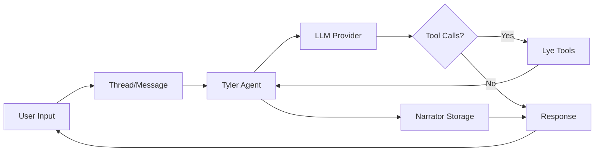

## Slide Architecture

Slide is designed as a collection of modular packages that work seamlessly together while remaining independent. This architecture provides flexibility and allows you to use only what you need.

## Core Components


### Tyler - The Agent Core

Tyler is the heart of Slide, providing:
- Agent orchestration and LLM integration
- Tool execution framework
- Streaming and async support
- Model Context Protocol (MCP) compatibility
- Evaluation and testing framework

### Lye - The Tool Library

Lye provides ready-to-use tools organized by capability:
- **Web Tools**: Search, fetch, scrape
- **Image Tools**: Analyze, extract text, process
- **Audio Tools**: Transcribe, text-to-speech
- **File Tools**: Read, write, manipulate
- **Browser Tools**: Screenshots, extraction

### Narrator - The Memory System

Narrator handles persistent storage:
- Thread management (conversation history)
- File storage for attachments
- Support for multiple backends:
  - In-memory (testing)
  - SQLite (local development)
  - PostgreSQL (production)

### Space Monkey - The Slack Bridge

Space Monkey enables Slack deployment:
- Event handling and routing
- Message formatting
- Thread management
- File handling

## How Components Work Together

```python
# Tyler provides the agent
from tyler import Agent, Thread, Message

# Lye provides tools
from lye import WEB_TOOLS, IMAGE_TOOLS

# Narrator provides persistence
from tyler import ThreadStore, FileStore

# They work together seamlessly
thread_store = await ThreadStore.create("sqlite+aiosqlite:///db.sqlite")
file_store = await FileStore.create("./files")

agent = Agent(
    name="my-agent",
    model_name="gpt-4",
    tools=[*WEB_TOOLS, *IMAGE_TOOLS],
    thread_store=thread_store,
    file_store=file_store
)
```

## Design Principles

### 1. Modularity
Each package is independent and can be used separately:
- Use Tyler alone for simple agents
- Use Lye in any Python project for tool utilities
- Use Narrator for any conversation management needs

### 2. Composability
Components are designed to work together:
- Tyler + Lye = Powerful agents with tools
- Tyler + Narrator = Agents with memory
- All together = Production-ready AI systems

### 3. Extensibility
Every component is designed for extension:
- Create custom tools
- Add new storage backends
- Integrate with any LLM provider
- Connect to MCP servers

### 4. Production-Ready
Built with real-world use in mind:
- Comprehensive error handling
- Structured logging
- Testing frameworks
- Performance optimization

## Data Flow



## When to Use Each Component

### Just Tyler
Perfect for:
- Simple conversational agents
- Prototyping and experiments
- Custom tool implementations

### Tyler + Lye
Ideal for:
- Agents that interact with external systems
- Research and analysis tasks
- Automation workflows

### Tyler + Narrator
Best for:
- Customer service bots
- Long-running conversations
- Applications needing context persistence

### Tyler + Lye + Narrator
Recommended for:
- Production applications
- Complex agent systems
- Multi-user environments

### Space Monkey
Use when:
- Deploying to Slack
- Building team collaboration tools
- Integrating with existing Slack workflows

## Next Steps

<CardGroup cols={2}>
  <Card
    title="How Agents Work"
    icon="robot"
    href="/concepts/how-agents-work"
  >
    Deep dive into agent internals
  </Card>
  <Card
    title="Tool System"
    icon="wrench"
    href="/concepts/tools"
  >
    Learn about the tool architecture
  </Card>
</CardGroup> 