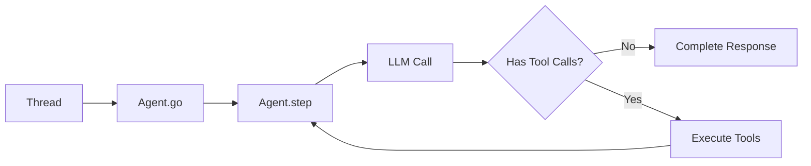

**💻 Code Examples**

<CardGroup cols={3}>
  <Card
    title="Basic Agent"
    icon="robot"
    href="https://github.com/adamwdraper/slide/blob/main/packages/tyler/examples/002_basic.py"
  >
    Minimal agent setup
  </Card>
  <Card
    title="Agent from Config"
    icon="file-code"
    href="https://github.com/adamwdraper/slide/blob/main/packages/tyler/examples/003_agent_from_config.py"
  >
    YAML configuration
  </Card>
  <Card
    title="Streaming"
    icon="bolt"
    href="https://github.com/adamwdraper/slide/blob/main/packages/tyler/examples/004_streaming.py"
  >
    Real-time responses
  </Card>
</CardGroup>

## How the agent works

Tyler uses an iterative approach to process messages and execute tools. Here's how it works:



### Processing Flow

When you call `agent.run()` (with or without streaming), Tyler follows these steps:

1. **Message Processing**
   - Loads the conversation thread
   - Processes any attached files (images, PDFs, etc.)
   - Ensures the system prompt is set

2. **Step Execution** 
   - Makes an LLM call with the current context
   - Processes the response for content and tool calls
   - Streams responses in real-time (if using `stream=True`)

3. **Tool Execution**
   - If tool calls are present, executes them in parallel
   - Adds tool results back to the conversation
   - Returns to step execution if more tools are needed

4. **Completion**
   - Saves the final thread state
   - Returns the processed thread and new messages

### Key Components

- **ToolRunner**: Manages the registry of available tools and handles execution
- **Thread**: Maintains conversation history and context
- **Message**: Represents user, assistant, and tool messages
- **ExecutionEvent**: Provides detailed execution telemetry and streaming updates

### Error Handling & Limits

Tyler includes built-in safeguards:
- Maximum tool iteration limit (default: 10)
- Automatic error recovery
- Structured error responses
- Tool execution timeout handling

## Creating an Agent

### Basic Agent

```python
from tyler import Agent

# Minimal agent configuration
agent = Agent(
    name="assistant",
    model_name="gpt-4",
    purpose="To be a helpful assistant"
)

# With additional configuration
agent = Agent(
    name="gpt4-assistant",
    model_name="gpt-4",
    purpose="To assist with various tasks",
    temperature=0.7
)
```

### Agent with Tools

```python
from tyler import Agent
from lye import WEB_TOOLS, FILES_TOOLS, IMAGE_TOOLS
from lye.web import search, fetch
from lye.files import read_file, write_file
from lye.image import analyze_image

# Using tool groups
agent = Agent(
    name="research-assistant",
    model_name="gpt-4",
    purpose="To help with research tasks",
    tools=[
        *WEB_TOOLS,      # All web tools
        *FILES_TOOLS,    # All file tools
        analyze_image    # Specific image tool
    ]
)

# Or using specific tools
agent = Agent(
    name="focused-assistant",
    model_name="gpt-4",
    purpose="To search and save information",
    tools=[search, fetch, read_file, write_file]
)
```

## Agent Capabilities

### 1. Tool Usage

Agents can intelligently select and use tools based on the task:

```python
from tyler import Agent, Thread, Message

# Create thread and message
thread = Thread()
message = Message(
    role="user",
    content="Search for recent AI developments and save a summary"
)
thread.add_message(message)

# Agent automatically chooses the right tools
result = await agent.run(thread)
# Agent will: 1) Use web.search, 2) Use web.fetch for details, 3) Use files.write
```

### 2. Multi-step Reasoning

Agents can break down complex tasks:

```python
thread = Thread()
message = Message(
    role="user",
    content="""
    1. Find the top 3 Python web frameworks
    2. Compare their features
    3. Create a comparison chart
    4. Save the analysis
    """
)
thread.add_message(message)

result = await agent.run(thread)
```

### 3. Context Awareness

With proper thread management, agents maintain conversation context:

```python
from tyler import Agent, Thread, Message, ThreadStore

# Set up persistent storage
thread_store = await ThreadStore.create("sqlite+aiosqlite:///conversations.db")

agent = Agent(
    name="assistant",
    model_name="gpt-4",
    thread_store=thread_store
)

# Create a thread
thread = Thread(id="research-session")

# First query
message1 = Message(role="user", content="What is FastAPI?")
thread.add_message(message1)
result = await agent.run(thread)

# Save the thread
await thread_store.save_thread(result.thread)

# Follow-up uses context
message2 = Message(role="user", content="How does it compare to Flask?")
result.thread.add_message(message2)
final_result = await agent.run(result.thread)
# Agent knows we're talking about FastAPI
```

## Advanced features

### Streaming Responses

For long-running tasks or real-time interaction:

```python
from tyler import Agent, Thread, Message
from tyler.models.execution import ExecutionEvent, EventType

thread = Thread()
message = Message(role="user", content="Write a detailed analysis of...")
thread.add_message(message)

async for event in agent.stream(thread):
    if event.type == EventType.LLM_STREAM_CHUNK:
        print(event.data.get("content_chunk", ""), end="", flush=True)
    elif event.type == EventType.TOOL_SELECTED:
        print(f"\n[Using tool: {event.data.get('tool_name', '')}]")
```

### Custom System Prompts

Fine-tune agent behavior:

```python
agent = Agent(
    name="code-reviewer",
    model_name="gpt-4",
    purpose="""You are an expert code reviewer. 
    Focus on: 
    - Security vulnerabilities
    - Performance optimizations
    - Best practices
    Always explain your reasoning."""
)
```

### Tool Configuration

Control how agents use tools:

```python
from lye import FILES_TOOLS

agent = Agent(
    name="safe-agent",
    model_name="gpt-4",
    purpose="To safely read and analyze files",
    tools=[FILES_TOOLS[0]],  # Just read_file tool
    tool_choice="auto",  # or "none", "required", or specific tool name
    parallel_tool_calls=True  # Enable parallel execution
)
```

## Agent Patterns

### 1. Supervisor Pattern

```python
# Note: This is a conceptual pattern - implement delegate_task and create_sub_agent
supervisor = Agent(
    name="supervisor",
    model_name="gpt-4",
    purpose="You coordinate work between specialized agents",
    tools=[delegate_task, create_sub_agent]
)

researcher = Agent(
    name="researcher", 
    model_name="gpt-4",
    purpose="To conduct research",
    tools=[*WEB_TOOLS]
)

writer = Agent(
    name="writer",
    model_name="gpt-4", 
    purpose="To write content",
    tools=[*FILES_TOOLS]
)
```

### 2. Tool Specialist Pattern

```python
from lye import IMAGE_TOOLS
from lye.files import read_csv, write_file

# Image specialist
image_agent = Agent(
    name="image-expert",
    model_name="gpt-4",
    purpose="You are an expert at image analysis and manipulation",
    tools=IMAGE_TOOLS
)

# Data specialist
data_agent = Agent(
    name="data-analyst",
    model_name="gpt-4",
    purpose="You are a data analysis expert",
    tools=[read_csv, write_file]  # Add your data analysis tools
)
```

### 3. Validation Pattern

```python
# Note: validation_fn is not a current Tyler feature
# Instead, use the evaluation framework for validation
from tyler.eval import AgentEval, Conversation, Expectation

eval = AgentEval(
    name="validation_test",
    conversations=[
        Conversation(
            user="Analyze this data",
            expect=Expectation(
                custom=lambda response: len(response["content"]) > 100
            )
        )
    ]
)
```

## Best practices

<AccordionGroup>
  <Accordion title="1. Name agents descriptively">
    Use clear, descriptive names that indicate the agent's purpose:
    ```python
    # Good
    agent = Agent(
        name="customer-support-agent",
        model_name="gpt-4",
        purpose="To help customers with product questions"
    )
    
    # Not as clear
    agent = Agent(name="agent1", model_name="gpt-4")
    ```
  </Accordion>

  <Accordion title="2. Limit tool access">
    Only provide tools the agent actually needs:
    ```python
    from lye.slack import send_message, read_channel
    from lye.notion import search_pages
    
    # Good - specific tools for the task
    email_agent = Agent(
        name="email-assistant",
        model_name="gpt-4",
        purpose="To manage email communications",
        tools=[send_message, read_channel, search_pages]
    )
    
    # Avoid - too many unnecessary tools
    from lye import TOOLS  # All available tools
    email_agent = Agent(
        name="email-assistant",
        model_name="gpt-4", 
        tools=TOOLS  # Includes unrelated tools
    )
    ```
  </Accordion>

  <Accordion title="3. Use appropriate models">
    Match model capabilities to task complexity:
    ```python
    # Simple tasks
    simple_agent = Agent(
        name="formatter",
        model_name="gpt-3.5-turbo",
        purpose="To format text"
    )
    
    # Complex reasoning
    complex_agent = Agent(
        name="analyzer",
        model_name="gpt-4",
        purpose="To perform deep analysis"
    )
    ```
  </Accordion>

  <Accordion title="4. Handle errors gracefully">
    Always implement error handling:
    ```python
    from tyler.exceptions import AgentError, ToolError
    
    try:
        thread = Thread()
        message = Message(role="user", content=task)
        thread.add_message(message)
        
        result = await agent.run(thread)
    except ToolError as e:
        print(f"Tool failed: {e}")
        # Retry with different approach
    except AgentError as e:
        print(f"Agent error: {e}")
        # Log and handle appropriately
    ```
  </Accordion>
</AccordionGroup>

## Testing Agents

Tyler provides a comprehensive evaluation framework for testing your agents:

```python
from tyler.eval import AgentEval, Conversation, Expectation, ToolUsageScorer

# Define test scenarios
eval = AgentEval(
    name="agent_test",
    conversations=[
        Conversation(
            user="Calculate the sum of 15 and 27",
            expect=Expectation(
                mentions=["42"],
                completes_task=True
            )
        )
    ],
    scorers=[ToolUsageScorer()]
)

# Run tests with mock tools
results = await eval.run(agent)
```

Key testing features:
- **Mock Tools**: Prevent real API calls during testing
- **Flexible Expectations**: Test content, behavior, and tool usage
- **Multiple Scorers**: Evaluate tone, task completion, and more
- **Multi-turn Conversations**: Test complex interaction flows

<Tip>
  Always test your agents with the evaluation framework before deployment. See the [full evaluation guide](/packages/tyler/evaluations) for details.
</Tip>

## Performance Considerations

- **Token Usage**: Monitor and optimize prompts to reduce token consumption
- **Tool Calls**: Minimize unnecessary tool invocations
- **Caching**: Use Narrator's thread system to avoid redundant work
- **Parallel Execution**: Enable `parallel_tool_calls` when tools can run concurrently

## Next steps

<CardGroup cols={2}>
  <Card
    title="Tools"
    icon="toolbox"
    href="/concepts/tools"
  >
    Learn about tools and how to create custom ones
  </Card>
  <Card
    title="MCP Integration"
    icon="plug"
    href="/concepts/mcp"
  >
    Understand Model Context Protocol integration
  </Card>
  <Card
    title="Tyler Examples"
    icon="code"
    href="/packages/tyler/examples"
  >
    See practical agent examples
  </Card>
  <Card
    title="API Reference"
    icon="book"
    href="/api-reference/introduction"
  >
    Detailed API documentation
  </Card>
</CardGroup> 