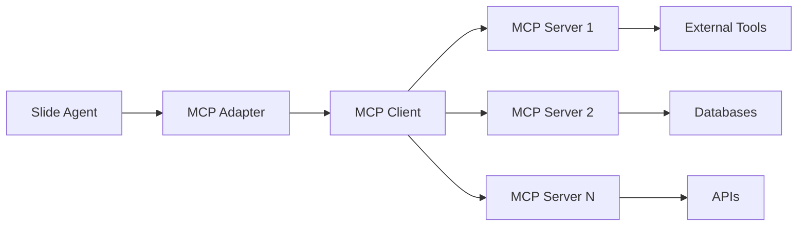

## What is MCP?

The Model Context Protocol (MCP) is an open standard that enables seamless communication between AI applications and external tools. Slide's Tyler package includes first-class MCP support, allowing your agents to:

- Connect to any MCP-compatible server
- Use tools from external services
- Share context across applications
- Build interoperable AI systems

## MCP Architecture in Slide



## Quick Start

### Connecting to an MCP Server

```python
import asyncio
from tyler import Agent, Thread, Message
from tyler.mcp import MCPAdapter

async def main():
    # Create MCP adapter
    adapter = MCPAdapter()
    
    # Connect to a local MCP server
    await adapter.connect("stdio://./my-mcp-server")
    
    # Or connect to a remote server
    # await adapter.connect("ws://localhost:8080")
    
    # Create agent with MCP tools
    agent = Agent(
        name="mcp-enhanced-agent",
        model_name="gpt-4",
        purpose="To use MCP tools for tasks",
        mcp_adapter=adapter
    )
    
    # List available tools
    tools = await adapter.list_tools()
    print(f"Available MCP tools: {[t.name for t in tools]}")
    
    # Use the agent
    thread = Thread()
    message = Message(
        role="user",
        content="Use the database query tool to find all users created this week"
    )
    thread.add_message(message)
    
    result = await agent.go(thread)

if __name__ == "__main__":
    asyncio.run(main())
```

### Using MCP Tools

Once connected, MCP tools are automatically available to your agent:

```python
# Create thread and message
thread = Thread()
message = Message(
    role="user",
    content="Use the database query tool to find all users created this week"
)
thread.add_message(message)

# Agent can now use any tools exposed by the MCP server
result = await agent.go(thread)
```

## MCP Server Types

### 1. Stdio Servers

Local processes that communicate via standard input/output:

```python
# Connect to a Node.js MCP server
await adapter.connect("stdio://node ./mcp-server.js")

# Connect to a Python MCP server
await adapter.connect("stdio://python mcp_server.py")

# With custom arguments
await adapter.connect("stdio://./server --config production.json")
```

### 2. WebSocket Servers

Network-accessible servers:

```python
# Basic WebSocket connection
await adapter.connect("ws://localhost:8080")

# Secure WebSocket
await adapter.connect("wss://mcp.example.com")

# With authentication
await adapter.connect(
    "wss://mcp.example.com",
    headers={"Authorization": "Bearer your-token"}
)
```

### 3. SSE (Server-Sent Events) Servers

For streaming connections:

```python
# Connect to SSE server
await adapter.connect("sse://localhost:3000/events")
```

## Creating MCP Servers

### Using FastMCP (Python)

Create an MCP server that exposes tools to Slide:

```python
from fastmcp import FastMCP

# Create MCP server
mcp = FastMCP()

@mcp.tool()
async def search_knowledge_base(query: str) -> str:
    """Search internal knowledge base."""
    # Your implementation
    results = await db.search(query)
    return format_results(results)

@mcp.tool()
async def execute_sql(query: str, database: str = "main") -> dict:
    """Execute SQL query safely."""
    if not is_safe_query(query):
        return {"error": "Unsafe query"}
    
    conn = get_connection(database)
    results = await conn.execute(query)
    return {"data": results}

# Run the server
if __name__ == "__main__":
    mcp.run()
```

### MCP Server Configuration

```json
{
  "name": "my-tools-server",
  "version": "1.0.0",
  "tools": {
    "search_knowledge_base": {
      "description": "Search internal knowledge base",
      "input_schema": {
        "type": "object",
        "properties": {
          "query": {
            "type": "string",
            "description": "Search query"
          }
        },
        "required": ["query"]
      }
    }
  }
}
```

## Advanced MCP Usage

### Multiple Server Connections

Connect to multiple MCP servers simultaneously:

```python
import asyncio
from tyler import Agent, Thread, Message
from tyler.mcp import MCPAdapter

async def main():
    # Create adapter
    adapter = MCPAdapter()
    
    # Connect to multiple servers
    await adapter.connect("stdio://./database-tools")
    await adapter.connect("ws://localhost:8080")  # API tools
    await adapter.connect("stdio://./ml-tools")    # ML model tools
    
    # Agent has access to all tools
    agent = Agent(
        name="multi-server-agent",
        model_name="gpt-4",
        purpose="To use tools from multiple MCP servers",
        mcp_adapter=adapter
    )
    
    # List all available tools
    all_tools = await adapter.list_tools()
    print(f"Total tools available: {len(all_tools)}")
    
    # Use the agent
    thread = Thread()
    message = Message(role="user", content="Analyze the latest data and create predictions")
    thread.add_message(message)
    
    result = await agent.go(thread)

if __name__ == "__main__":
    asyncio.run(main())
```

### Dynamic Tool Discovery

```python
# Discover tools at runtime
async def discover_and_use_tools(adapter: MCPAdapter, task: str):
    # List available tools
    tools = await adapter.list_tools()
    
    # Filter relevant tools
    relevant_tools = [
        t for t in tools 
        if any(keyword in t.description.lower() 
               for keyword in task.lower().split())
    ]
    
    print(f"Found {len(relevant_tools)} relevant tools for: {task}")
    
    # Create specialized agent
    agent = Agent(
        name="dynamic-agent",
        model_name="gpt-4",
        purpose=f"You have access to these tools: {relevant_tools}",
        mcp_adapter=adapter
    )
    
    # Create thread and execute task
    thread = Thread()
    message = Message(role="user", content=task)
    thread.add_message(message)
    
    result = await agent.go(thread)
    return result.thread
```

### Context Sharing

MCP enables context sharing between different systems:

```python
# Share context with MCP server
await adapter.set_context({
    "user_id": "12345",
    "session": "current-session",
    "preferences": {"language": "en", "timezone": "UTC"}
})

# Context is now available to all MCP tools
thread = Thread()
message = Message(
    role="user",
    content="Get personalized recommendations"
    # MCP tools can access the context
)
thread.add_message(message)

result = await agent.go(thread)
```

## MCP Security

### Authentication

```python
# API Key authentication
await adapter.connect(
    "wss://mcp.example.com",
    headers={"X-API-Key": os.getenv("MCP_API_KEY")}
)

# OAuth2 authentication
token = await get_oauth_token()
await adapter.connect(
    "wss://mcp.example.com",
    headers={"Authorization": f"Bearer {token}"}
)
```

### Permission Management

```python
# Configure allowed tools
adapter = MCPAdapter(
    allowed_tools=["read_file", "list_directory"],  # Whitelist
    blocked_tools=["delete_file", "execute_command"]  # Blacklist
)
```

## Best Practices

<AccordionGroup>
  <Accordion title="1. Connection Management">
    Always properly manage MCP connections:
    ```python
    adapter = MCPAdapter()
    try:
        await adapter.connect("stdio://./server")
        # Use adapter
    finally:
        await adapter.disconnect()
    ```
    
    Or use context managers:
    ```python
    async with MCPAdapter() as adapter:
        await adapter.connect("stdio://./server")
        # Adapter disconnects automatically
    ```
  </Accordion>

  <Accordion title="2. Error Handling">
    Handle MCP-specific errors:
    ```python
    from tyler.mcp.exceptions import (
        MCPConnectionError,
        MCPToolError,
        MCPTimeoutError
    )
    
    try:
        await adapter.connect(server_url)
    except MCPConnectionError as e:
        print(f"Failed to connect: {e}")
        # Implement fallback
    except MCPTimeoutError as e:
        print(f"Connection timeout: {e}")
        # Retry logic
    ```
  </Accordion>

  <Accordion title="3. Tool Validation">
    Validate tools before use:
    ```python
    # Check if required tools are available
    required_tools = ["database_query", "file_read"]
    available = await adapter.list_tools()
    available_names = [t.name for t in available]
    
    missing = set(required_tools) - set(available_names)
    if missing:
        raise ValueError(f"Missing required tools: {missing}")
    ```
  </Accordion>

  <Accordion title="4. Performance Optimization">
    Optimize MCP usage:
    ```python
    # Cache tool lists
    @functools.lru_cache(maxsize=10)
    async def get_cached_tools(server_url: str):
        adapter = MCPAdapter()
        await adapter.connect(server_url)
        return await adapter.list_tools()
    
    # Reuse connections
    class MCPPool:
        def __init__(self):
            self.connections = {}
        
        async def get_adapter(self, server_url: str):
            if server_url not in self.connections:
                adapter = MCPAdapter()
                await adapter.connect(server_url)
                self.connections[server_url] = adapter
            return self.connections[server_url]
    ```
  </Accordion>
</AccordionGroup>

## MCP + Slide Patterns

### 1. Tool Aggregation Pattern

Combine MCP tools with native Slide tools:

```python
from tyler import Agent, Thread, Message
from tyler.mcp import MCPAdapter
from lye import WEB_TOOLS, FILES_TOOLS

async def main():
    # Connect to MCP server for specialized tools
    adapter = MCPAdapter()
    await adapter.connect("stdio://./domain-specific-tools")
    
    # Create agent with both MCP and native tools
    agent = Agent(
        name="hybrid-agent",
        model_name="gpt-4",
        purpose="To use both native and MCP tools",
        tools=[*WEB_TOOLS, *FILES_TOOLS],  # Native Slide tools
        mcp_adapter=adapter  # MCP tools
    )
    
    # Agent can use both tool sets
    thread = Thread()
    message = Message(
        role="user",
        content="Search the web for data and then process it with our custom analyzer"
    )
    thread.add_message(message)
    
    result = await agent.go(thread)
```

### 2. Fallback Pattern

Use MCP tools as fallbacks:

```python
from tyler.exceptions import ToolError

async def execute_with_fallback(agent: Agent, task: str):
    thread = Thread()
    message = Message(role="user", content=task)
    thread.add_message(message)
    
    try:
        # Try with native tools first
        return await agent.go(thread)
    except ToolError:
        # Fallback to MCP tools
        if agent.mcp_adapter:
            # Force MCP tool usage by modifying the prompt
            fallback_message = Message(
                role="user",
                content=f"Use MCP tools to: {task}"
            )
            fallback_thread = Thread()
            fallback_thread.add_message(fallback_message)
            return await agent.go(fallback_thread)
        raise
```

### 3. Federation Pattern

Create a network of specialized MCP servers:

```python
async def create_federated_agent():
    adapter = MCPAdapter()
    
    # Connect to specialized servers
    await adapter.connect("stdio://./nlp-tools")      # NLP tasks
    await adapter.connect("stdio://./vision-tools")   # Computer vision
    await adapter.connect("stdio://./data-tools")     # Data processing
    
    agent = Agent(
        name="federated-agent",
        model_name="gpt-4",
        purpose="To coordinate across specialized tool servers",
        mcp_adapter=adapter
    )
    
    # Agent automatically routes to appropriate tools
    thread = Thread()
    message = Message(
        role="user",
        content="Analyze this image and create a summary report with data visualizations"
    )
    thread.add_message(message)
    
    result = await agent.go(thread)
    return result.thread
```

## Troubleshooting

<Warning>
  Common MCP issues and solutions:
  
  - **Connection refused**: Check if MCP server is running
  - **Tool not found**: Verify tool is exposed by server
  - **Timeout errors**: Increase timeout or check network
  - **Permission denied**: Verify authentication credentials
</Warning>

## Next Steps

<CardGroup cols={2}>
  <Card
    title="Tyler MCP Adapters"
    icon="plug"
    href="/packages/tyler/mcp-adapters"
  >
    Deep dive into MCP adapters
  </Card>
  <Card
    title="MCP Examples"
    icon="code"
    href="/packages/tyler/examples#mcp"
  >
    See MCP integration examples
  </Card>
  <Card
    title="Create MCP Server"
    icon="server"
    href="https://github.com/modelcontextprotocol/python-sdk"
  >
    Build your own MCP server
  </Card>
  <Card
    title="MCP Specification"
    icon="book"
    href="https://modelcontextprotocol.org"
  >
    Read the MCP specification
  </Card>
</CardGroup> 