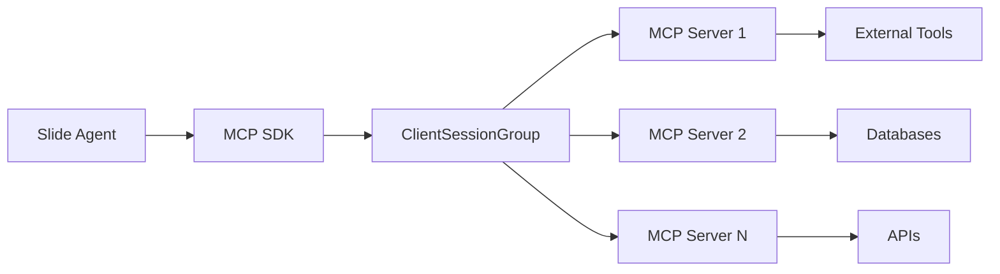

<Note>
**Recommended Reading**: For practical implementation details, see the [MCP Integration Guide](/guides/mcp-integration).
</Note>

**💻 Code Examples**

<CardGroup cols={2}>
  <Card
    title="Basic MCP"
    icon="rocket"
    href="https://github.com/adamwdraper/slide/blob/main/packages/tyler/examples/300_mcp_basic.py"
  >
    Get started with MCP
  </Card>
  <Card
    title="Advanced MCP"
    icon="server"
    href="https://github.com/adamwdraper/slide/blob/main/packages/tyler/examples/301_mcp_advanced.py"
  >
    Multiple servers & filtering
  </Card>
</CardGroup>

## What is MCP?

The Model Context Protocol (MCP) is an open standard that enables seamless communication between AI applications and external tools. Slide's Tyler package includes first-class MCP support, allowing your agents to:

- Connect to any MCP-compatible server
- Use tools from external services
- Share context across applications
- Build interoperable AI systems

## MCP Architecture in Slide



Tyler uses the official MCP SDK's `ClientSessionGroup` to manage connections to multiple MCP servers simultaneously. This provides:

- Automatic session lifecycle management
- Tool discovery and aggregation across servers
- Tool execution routing to the correct server
- Support for all SDK transport types (stdio, SSE, StreamableHTTP)

## Quick Start

### Python API (Recommended)

```python
import asyncio
from tyler import Agent, Thread, Message

async def main():
    # Create agent with MCP config (validates schema immediately)
    agent = Agent(
        name="Tyler",
        model_name="gpt-4.1",
        tools=["web"],
        mcp={
            "servers": [{
                "name": "docs",
                "transport": "streamablehttp",  # Use for Mintlify and hosted servers
                "url": "https://slide.mintlify.app/mcp"
            }]
        }
    )

    # Connect to MCP servers (fail fast!)
    await agent.connect_mcp()
    
    # Use the agent - MCP tools are now available
    thread = Thread()
    thread.add_message(Message(
        role="user",
        content="How do I create a Tyler agent?"
    ))
    
    result = await agent.run(thread)
    print(result.content)
    
    # Cleanup MCP connections
    await agent.cleanup()

if __name__ == "__main__":
    asyncio.run(main())
```

### Using MCP Tools

Once connected, MCP tools are automatically available to your agent with namespaced names:

```python
# Tools from server "docs" become available as:
# - docs_SearchSlideFramework
# - docs_GetDocument
# etc.

# The agent automatically selects and uses appropriate tools
thread = Thread()
thread.add_message(Message(
    role="user",
    content="Search the Slide documentation for information about streaming"
))

result = await agent.run(thread)
```

## MCP Server Types

### 1. Stdio Servers

Local processes that communicate via standard input/output. Great for local tools and development:

```python
mcp={
    "servers": [{
        "name": "filesystem",
        "transport": "stdio",
        "command": "npx",
        "args": ["-y", "@modelcontextprotocol/server-filesystem", "/tmp"],
        "env": {"NODE_ENV": "production"}  # Optional environment
    }]
}
```

### 2. StreamableHTTP Servers

HTTP-based servers using the newer streaming protocol. Recommended for hosted MCP servers:

```python
mcp={
    "servers": [{
        "name": "docs",
        "transport": "streamablehttp",
        "url": "https://slide.mintlify.app/mcp",
        "headers": {"X-API-Key": "${API_KEY}"}  # Optional auth
    }]
}
```

### 3. SSE (Server-Sent Events) Servers

Legacy HTTP transport for streaming connections:

```python
mcp={
    "servers": [{
        "name": "legacy",
        "transport": "sse",
        "url": "https://legacy.example.com/mcp"
    }]
}
```

## Creating MCP Servers

### Using FastMCP (Python)

Create an MCP server that exposes tools to Slide:

```python
from fastmcp import FastMCP

# Create MCP server
mcp = FastMCP()

@mcp.tool()
async def search_knowledge_base(query: str) -> str:
    """Search internal knowledge base."""
    results = await db.search(query)
    return format_results(results)

@mcp.tool()
async def execute_sql(query: str, database: str = "main") -> dict:
    """Execute SQL query safely."""
    if not is_safe_query(query):
        return {"error": "Unsafe query"}
    
    conn = get_connection(database)
    results = await conn.execute(query)
    return {"data": results}

# Run the server
if __name__ == "__main__":
    mcp.run()
```

## Advanced MCP Usage

### Multiple Server Connections

Connect to multiple MCP servers simultaneously:

```python
agent = Agent(
    name="multi-server-agent",
    model_name="gpt-4.1",
    mcp={
        "servers": [
            {
                "name": "docs",
                "transport": "streamablehttp",
                "url": "https://slide.mintlify.app/mcp",
                "prefix": "slide"  # Custom prefix
            },
            {
                "name": "github",
                "transport": "stdio",
                "command": "npx",
                "args": ["-y", "@modelcontextprotocol/server-github"],
                "env": {"GITHUB_PERSONAL_ACCESS_TOKEN": "${GITHUB_TOKEN}"},
                "prefix": "gh",
                "fail_silent": True  # Continue if GitHub unavailable
            },
            {
                "name": "filesystem",
                "transport": "stdio",
                "command": "npx",
                "args": ["-y", "@modelcontextprotocol/server-filesystem", "/tmp"],
                "exclude_tools": ["write_file", "delete_file"]  # Read-only
            }
        ]
    }
)

await agent.connect_mcp()

# Agent now has tools from all servers:
# - slide_SearchSlideFramework
# - gh_search_repos
# - filesystem_read_file, filesystem_list_directory
```

### Tool Filtering

Control which tools are available:

```python
{
    "name": "filesystem",
    "transport": "stdio",
    "command": "mcp-server-filesystem",
    "include_tools": ["read_file", "list_directory"],  # Whitelist
    "exclude_tools": ["delete_file"]  # Blacklist (applied after include)
}
```

### Custom Prefixes

Override the default namespace prefix for cleaner tool names:

```python
{
    "name": "wandb_documentation_server",  # Long server name
    "prefix": "docs",  # Short, clean prefix
    "transport": "streamablehttp",
    "url": "https://docs.wandb.ai/mcp"
}
# Tools become: docs_search, docs_query (not wandb_documentation_server_search)
```

### Environment Variable Substitution

Use environment variables for secrets (recommended!):

```python
mcp={
    "servers": [{
        "name": "api",
        "transport": "streamablehttp",
        "url": "https://api.example.com/mcp",
        "headers": {
            "Authorization": "Bearer ${API_TOKEN}",  # Substituted from env
            "X-API-Key": "${API_KEY}"
        }
    }]
}
```

### Graceful Degradation

Control failure behavior per server:

```python
{
    "servers": [
        {
            "name": "critical",
            "url": "...",
            "fail_silent": False  # Fail startup if unavailable
        },
        {
            "name": "optional",
            "url": "...",
            "fail_silent": True  # Continue if unavailable (default)
        }
    ]
}
```

## Best Practices

<AccordionGroup>
  <Accordion title="1. Connection Management">
    Always cleanup MCP connections in long-running applications:
    ```python
    agent = Agent(mcp={...})
    try:
        await agent.connect_mcp()
        # Use agent
    finally:
        await agent.cleanup()
    ```
    
    For short scripts with `streamablehttp` transport, cleanup is required:
    ```python
    async def main():
        agent = Agent(mcp={"servers": [{"transport": "streamablehttp", ...}]})
        await agent.connect_mcp()
        result = await agent.run(thread)
        await agent.cleanup()  # Required for streamablehttp
    ```
  </Accordion>

  <Accordion title="2. Security">
    Never hardcode secrets:
    ```python
    # Good
    "headers": {"Authorization": "Bearer ${API_TOKEN}"}
    
    # Bad
    "headers": {"Authorization": "Bearer sk-1234567890"}
    ```
    
    Only connect to trusted MCP servers - they execute with your agent's permissions.
  </Accordion>

  <Accordion title="3. Tool Organization">
    Use custom prefixes for cleaner tool names:
    ```python
    {
        "name": "long_server_name",
        "prefix": "short",  # Tools become short_toolname
        ...
    }
    ```
  </Accordion>

  <Accordion title="4. Fail-Safe Configuration">
    Use `fail_silent: True` for optional servers:
    ```python
    {
        "name": "optional_feature",
        "fail_silent": True,  # Won't break startup
        ...
    }
    ```
  </Accordion>
</AccordionGroup>

## Troubleshooting

<Warning>
  Common MCP issues and solutions:
  
  - **Connection refused**: Check if MCP server is running and URL is correct
  - **Tool not found**: Verify tool is exposed by server, check `include_tools`/`exclude_tools`
  - **Timeout errors**: Increase timeout or check network connectivity
  - **Permission denied**: Verify authentication credentials
  - **Environment variable not substituted**: Ensure variable is set before running
</Warning>

## Next Steps

<CardGroup cols={2}>
  <Card
    title="MCP Integration Guide"
    icon="plug"
    href="/guides/mcp-integration"
  >
    Detailed configuration reference
  </Card>
  <Card
    title="MCP Examples"
    icon="code"
    href="https://github.com/adamwdraper/slide/tree/main/packages/tyler/examples"
  >
    See MCP integration examples
  </Card>
  <Card
    title="Create MCP Server"
    icon="server"
    href="https://github.com/modelcontextprotocol/python-sdk"
  >
    Build your own MCP server
  </Card>
  <Card
    title="MCP Specification"
    icon="book"
    href="https://modelcontextprotocol.org"
  >
    Read the MCP specification
  </Card>
</CardGroup>
