## The Slide Ecosystem

Slide is designed as a modular framework consisting of four specialized packages that work together seamlessly. Each package serves a specific purpose and can be used independently or as part of the complete framework.

```mermaid
graph TB
    subgraph "Slide Framework"
        Tyler["🤖 Tyler<br/>Agent Framework"]
        Lye["🛠️ Lye<br/>Tool Library"]
        Narrator["💾 Narrator<br/>Storage & Threading"]
        SpaceMonkey["🐵 Space Monkey<br/>Slack Integration"]
        
        Tyler --> Lye
        Tyler --> Narrator
        SpaceMonkey --> Tyler
        Tyler -.->|MCP| External["External Services"]
    end
```



## Package Summary

<CardGroup cols={2}>
  <Card title="Tyler" icon="robot">
    **Core Agent Framework**
    - Create autonomous AI agents
    - Tool orchestration
    - MCP protocol support
    - Streaming responses
    
    ```bash
    uv add tyler
    ```
  </Card>
  
  <Card title="Lye" icon="toolbox">
    **Utility Tool Library**
    - Audio processing
    - Browser automation
    - File operations
    - Image analysis
    - Web scraping
    
    ```bash
    uv add lye
    ```
  </Card>
  
  <Card title="Narrator" icon="database">
    **Thread & Storage Management**
    - Conversation history
    - Thread management
    - Multiple storage backends
    - State persistence
    
    ```bash
    uv add narrator
    ```
  </Card>
  
  <Card title="Space Monkey" icon="slack">
    **Slack Bot Framework**
    - Deploy agents to Slack
    - Event handling
    - Message classification
    - Interactive components
    
    ```bash
    uv add space-monkey
    ```
  </Card>
</CardGroup>

## Package Relationships

### Tyler + Lye
Tyler agents use Lye tools to interact with the world:

```python
from tyler import Agent
from lye import audio, browser, files

agent = Agent(
    name="assistant",
    tools=[
        audio.transcribe,
        browser.screenshot,
        files.write
    ]
)
```

### Tyler + Narrator
Narrator provides memory and context to Tyler agents:

```python
from tyler import Agent
from narrator import Thread, FileStore

store = FileStore("./conversations")
thread = Thread(store=store)

agent = Agent(
    name="assistant",
    thread=thread  # Agent now has memory
)
```

### Tyler + Space Monkey
Space Monkey deploys Tyler agents as Slack bots:

```python
from tyler import Agent
from space_monkey import SlackApp

agent = Agent(name="slack-bot")
app = SlackApp(agent=agent)
```

### Complete Integration
All packages working together:

```python
from tyler import Agent
from lye import web, files
from narrator import Thread, FileStore
from space_monkey import SlackApp

# Storage for conversation history
store = FileStore("./slack-conversations")
thread = Thread(store=store)

# Agent with tools and memory
agent = Agent(
    name="company-assistant",
    tools=[web.search, files.read],
    thread=thread
)

# Deploy as Slack bot
app = SlackApp(agent=agent)
app.start()
```

## Installation Options

### Install Everything
```bash
# Using uv (recommended)
uv add tyler lye narrator space-monkey

# Using pip
pip install tyler lye narrator space-monkey
```

### Install What You Need
```bash
# Just the agent framework
uv add tyler

# Agent + tools
uv add tyler lye

# Agent + memory
uv add tyler narrator

# Full Slack bot
uv add tyler lye narrator space-monkey
```

## Version Compatibility

All Slide packages follow semantic versioning and maintain compatibility within major versions:

| Package | Current Version | Python Required |
|---------|----------------|-----------------|
| tyler | 1.0.0 | >= 3.8 |
| lye | 1.0.0 | >= 3.8 |
| narrator | 1.0.0 | >= 3.8 |
| space-monkey | 1.0.0 | >= 3.8 |

<Note>
  Always use matching major versions across Slide packages for best compatibility.
</Note>

## Common Use Cases

### 1. Research Assistant
```python
# Uses: tyler + lye
from tyler import Agent
from lye import web, files

agent = Agent(
    name="researcher",
    tools=[web.search, web.fetch, files.write]
)
```

### 2. Customer Support Bot
```python
# Uses: tyler + narrator + space-monkey
from tyler import Agent
from narrator import Thread
from space_monkey import SlackApp

agent = Agent(
    name="support-bot",
    thread=Thread()  # Remember conversations
)
app = SlackApp(agent=agent)
```

### 3. Data Processing Pipeline
```python
# Uses: tyler + lye + narrator
from tyler import Agent
from lye import files, image
from narrator import Thread

agent = Agent(
    name="data-processor",
    tools=[files.read_csv, image.analyze],
    thread=Thread()  # Track processing history
)
```

### 4. MCP Integration Hub
```python
# Uses: tyler + external MCP servers
from tyler import Agent
from tyler.mcp import MCPAdapter

adapter = MCPAdapter()
await adapter.connect("stdio://./custom-tools")

agent = Agent(
    name="mcp-hub",
    mcp_adapter=adapter
)
```

## Architecture Decisions

### Why Separate Packages?

1. **Modularity**: Use only what you need
2. **Independent Development**: Each package can evolve separately
3. **Clear Boundaries**: Well-defined responsibilities
4. **Testing**: Easier to test in isolation
5. **Licensing**: Different packages can have different licenses if needed

### Design Principles

- **Async First**: All packages use async/await for performance
- **Type Safe**: Full type hints for better IDE support
- **Extensible**: Easy to add custom tools and adapters
- **Well Tested**: Comprehensive test suites
- **Production Ready**: Built for real-world usage

## Getting Started

<Steps>
  <Step title="Choose Your Packages">
    Decide which packages you need based on your use case
  </Step>
  
  <Step title="Install Dependencies">
    ```bash
    uv add [packages you need]
    ```
  </Step>
  
  <Step title="Follow Package Guides">
    Each package has detailed documentation:
    - [Tyler Guide](/packages/tyler/introduction)
    - [Lye Guide](/packages/lye/introduction)
    - [Narrator Guide](/packages/narrator/introduction)
    - [Space Monkey Guide](/packages/space-monkey/introduction)
  </Step>
  
  <Step title="Build Your Application">
    Combine packages to create your AI application
  </Step>
</Steps>

## Next Steps

<CardGroup cols={2}>
  <Card
    title="Quickstart"
    icon="rocket"
    href="/quickstart"
  >
    Get up and running quickly
  </Card>
  <Card
    title="Examples"
    icon="code"
    href="/packages/tyler/examples"
  >
    See real-world examples
  </Card>
  <Card
    title="API Reference"
    icon="book"
    href="/api-reference/introduction"
  >
    Detailed API documentation
  </Card>
  <Card
    title="Community"
    icon="users"
    href="https://slide-community.slack.com"
  >
    Get help and share projects
  </Card>
</CardGroup> 