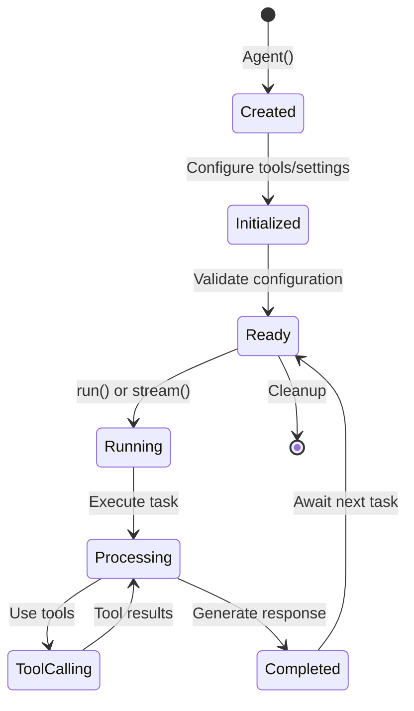

## What is Tyler?

Tyler is the heart of the Slide framework - a powerful, async-first agent framework for building autonomous AI applications. It provides everything you need to create, manage, and deploy intelligent agents that can use tools, maintain context, and integrate with external services via MCP.

## Key Features

<CardGroup cols={2}>
  <Card title="Autonomous Agents" icon="robot">
    Create agents that can reason, plan, and execute complex tasks independently
  </Card>
  <Card title="Tool Integration" icon="toolbox">
    Seamlessly integrate with Lye tools or create custom tools
  </Card>
  <Card title="MCP Support" icon="plug">
    Connect to any MCP-compatible server for extended capabilities
  </Card>
  <Card title="Streaming Responses" icon="stream">
    Real-time streaming for better user experience
  </Card>
  <Card title="Context Management" icon="brain">
    Built-in support for conversation history via Narrator
  </Card>
  <Card title="Multiple LLMs" icon="sparkles">
    Support for OpenAI, Anthropic, Google, and more
  </Card>
</CardGroup>

## Installation

<Tabs>
  <Tab title="uv (Recommended)">
    ```bash
    uv add tyler
    ```
  </Tab>
  <Tab title="pip">
    ```bash
    pip install tyler
    ```
  </Tab>
</Tabs>

## Quick Start

### Basic Agent

```python
from tyler import Agent

# Create a simple agent
agent = Agent(name="assistant")

# Run a task
result = await agent.run("What is the capital of France?")
print(result)
# Output: "The capital of France is Paris."
```

### Agent with Tools

```python
from tyler import Agent
from lye import web, files

# Create an agent with tools
agent = Agent(
    name="researcher",
    tools=[web.search, web.fetch, files.write],
    model="gpt-4"
)

# Agent can now search the web and save results
result = await agent.run(
    "Research the latest AI developments and save a summary"
)
```

### Agent with Memory

```python
from tyler import Agent
from narrator import Thread

# Create agent with conversation memory
thread = Thread(thread_id="chat-001")
agent = Agent(
    name="chatbot",
    thread=thread
)

# First message
await agent.run("My name is Alice")

# Agent remembers context
response = await agent.run("What's my name?")
print(response)
# Output: "Your name is Alice."
```

## Core Concepts

### Agent Lifecycle



### Tool Selection

Tyler agents intelligently select tools based on the task:

1. **Automatic Selection**: Agent analyzes the task and chooses appropriate tools
2. **Tool Chaining**: Complex tasks may require multiple tools in sequence
3. **Parallel Execution**: Independent tool calls run concurrently for efficiency

### Model Support

Tyler supports multiple LLM providers:

| Provider | Models | Streaming | Tool Calling |
|----------|--------|-----------|--------------|
| OpenAI | GPT-4, GPT-3.5 | ✅ | ✅ |
| Anthropic | Claude 3, Claude 2 | ✅ | ✅ |
| Google | Gemini Pro, Gemini Ultra | ✅ | ✅ |
| Local | Ollama, llama.cpp | ✅ | ⚠️ Limited |

## Architecture

Tyler follows a modular architecture:

```
tyler/
├── models/
│   └── agent.py          # Core Agent class
├── mcp/
│   ├── adapter.py        # MCP integration
│   └── client.py         # MCP client implementation
├── utils/
│   ├── tool_runner.py    # Tool execution engine
│   └── logging.py        # Structured logging
└── cli/
    └── chat.py           # Interactive CLI
```

## Advanced Features

### Custom System Prompts

```python
agent = Agent(
    name="expert",
    system_prompt="""You are an expert Python developer.
    Always write clean, well-documented code.
    Follow PEP 8 style guidelines."""
)
```

### Tool Configuration

```python
agent = Agent(
    name="controlled-agent",
    tools=[web.search, files.read],
    tool_choice="auto",           # or "none", "required"
    parallel_tool_calls=True,      # Enable parallel execution
    max_tool_calls=5              # Limit tool usage
)
```

### Error Handling

```python
from tyler.exceptions import AgentError, ToolError

try:
    result = await agent.run("Complex task")
except ToolError as e:
    print(f"Tool failed: {e.tool_name} - {e.message}")
except AgentError as e:
    print(f"Agent error: {e}")
```

### Streaming Responses

```python
# Stream responses for real-time output
async for chunk in agent.stream("Write a story about AI"):
    print(chunk, end="", flush=True)
```

## Integration Examples

### With Lye Tools

```python
from tyler import Agent
from lye import audio, image, browser

agent = Agent(
    name="multimedia-processor",
    tools=[
        audio.transcribe,
        image.analyze,
        browser.screenshot
    ]
)

# Process multimedia content
result = await agent.run(
    "Transcribe the audio from this video and analyze any images shown"
)
```

### With MCP Servers

```python
from tyler.mcp import MCPAdapter

# Connect to MCP server
adapter = MCPAdapter()
await adapter.connect("stdio://./custom-tools-server")

# Create agent with MCP tools
agent = Agent(
    name="mcp-agent",
    mcp_adapter=adapter
)
```

### With Narrator

```python
from narrator import Thread, PostgresStore

# Use PostgreSQL for production
store = PostgresStore("postgresql://...")
thread = Thread(store=store)

agent = Agent(
    name="production-bot",
    thread=thread,
    model="gpt-4"
)
```

## CLI Usage

Tyler includes an interactive CLI for testing:

```bash
# Start interactive chat
tyler chat

# With specific model
tyler chat --model gpt-4

# With tools
tyler chat --tools web.search,files.read

# Connect to MCP server
tyler chat --mcp stdio://./my-server
```

## Performance Tips

1. **Enable Parallel Tool Calls**: Set `parallel_tool_calls=True` for concurrent execution
2. **Use Appropriate Models**: Match model complexity to task requirements
3. **Cache Responses**: Integrate with Narrator for response caching
4. **Limit Tool Calls**: Set `max_tool_calls` to prevent infinite loops
5. **Stream Long Responses**: Use `stream()` for better perceived performance

## Next Steps

<CardGroup cols={2}>
  <Card
    title="Agent Configuration"
    icon="cog"
    href="/packages/tyler/agents"
  >
    Deep dive into agent configuration
  </Card>
  <Card
    title="MCP Adapters"
    icon="plug"
    href="/packages/tyler/mcp-adapters"
  >
    Learn about MCP integration
  </Card>
  <Card
    title="Examples"
    icon="code"
    href="/packages/tyler/examples"
  >
    See practical examples
  </Card>
  <Card
    title="API Reference"
    icon="book"
    href="/api-reference/tyler"
  >
    Complete API documentation
  </Card>
</CardGroup> 